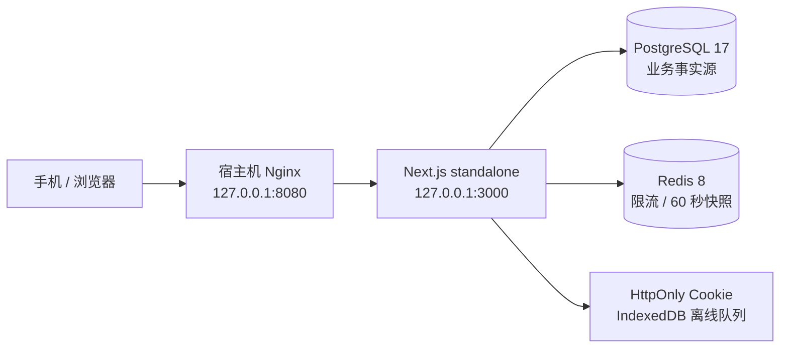

# 架构

## 决策

前端和业务 API 保持在同一个 Next.js standalone 容器，PostgreSQL 与 Redis 使用独立容器。当前家庭规模下，单独拆出前端容器和 API 容器会增加跨域、会话、发布顺序与监控成本，却没有独立扩缩容收益。Next.js 在这里承担 BFF：浏览器只访问一个同源入口，业务数据始终经由服务端 API。

只有应用容器映射到宿主机回环地址；PostgreSQL 与 Redis 不发布端口，三者只在应用专用的
`fribench-pick-meal-well-backend-v1` 内部网络通信。该网络不复用服务器旧平台网络，
避免多个 Compose 项目的 `postgres`、`redis` 服务别名互相污染。

## 代码边界

- `app/`：App Router 页面、组件和 API 路由。
- `app/lib/mutations.ts`：客户端和服务端共享的 Zod mutation 协议。
- `app/lib/server/repository.ts`：家庭范围查询、短事务、幂等回执和原子业务写入。
- `app/lib/server/redis.ts`：登录限流与可失效快照缓存。
- `app/lib/auth/`：Argon2id 口令、随机 session token 与 Cookie 会话。
- `app/lib/offline-store.ts`：最近快照和按自增序号重放的待同步队列。
- `db/schema.ts` 与 `drizzle/`：PostgreSQL 模式及可审查迁移。
- `compose.prod.yml`、`Dockerfile` 与 `ops/`：正式运行、Nginx、备份和 systemd 资产。

## 数据与安全边界

PostgreSQL 是唯一业务事实源；Redis 丢失时只影响缓存和限流可用性，不丢家庭数据。所有业务表均带 `household_id`，关系表使用复合外键防止跨家庭引用。共享口令只保存 Argon2id 哈希，session token 只保存 SHA-256 摘要。

首次认领同时要求 `/etc/fribench/setup_token` 中的服务器初始化令牌，避免公开空实例被抢占。所有 JSON 写请求限制为 32 KiB、校验同源、使用严格 Zod 模式；登录和重置通过 Redis 限流。

## 关键一致性流程

1. 客户端为每个 mutation 生成 UUID；离线时按创建顺序保存。
2. 服务端在 PostgreSQL 同一事务中写入 `(household_id, mutation_id)` 回执、执行业务写入并递增版本。
3. 重复重放命中回执后不再执行；失败事务不会留下回执。
4. “接受推荐”由服务端重新读取菜谱、份数和库存，在一个事务内记录决定并把缺口合并进采购清单，客户端不能提交成本或缺口结论。
5. 家庭重置会轮换 `data_epoch`；其他设备旧纪元的离线 mutation 返回 409，不会污染重置后的数据。
